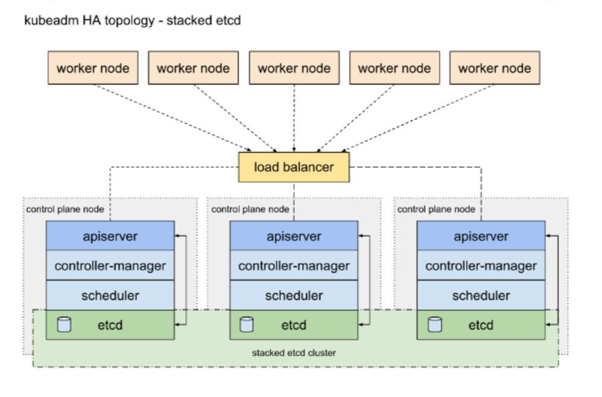
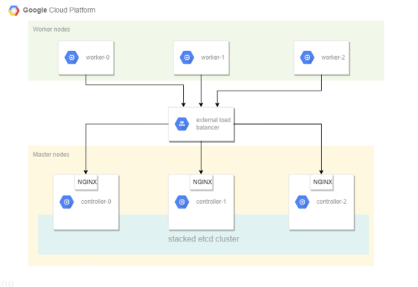

# open5gs-gcp-kubernetes-high-availability

Based on [GCP 5G Simulation Using open5gs with Kubernetes High Availability](https://indoslab.medium.com/5g-simulation-using-open5gs-in-gcp-with-kubernetes-high-availability-c1323e1a48b1)

* Self-managed Kubernetes High Availability in Google Compute Engine
* This guide is not for people looking for a fully automated command to bring up a Kubernetes cluster
* GCE use because sctp needed for open5gs, GKE nodes do not support sctp, it was failed in GKE, if later GCP support sctp in GKE nodes, probably better to use GKE.
* Calico, Containerd, Kubernetes v1.22.x, ROOK, CEPH, HELM, Istio, Open5Gs, Rancher, nginx
* The results of this tutorial should not be viewed as production ready, and may receive limited support from the community, but don’t let that stop you from learning!

## Topology

source : kubernetes.io

## Topology GCP

## Labs

This tutorial assumes you have access to the [Google Cloud Platform](https://cloud.google.com). While GCP is used for basic infrastructure requirements the lessons learned in this tutorial can be applied to other platforms.

* [Prerequisites](docs/01-prerequisites.md)
* [Part 1 - GCP login and Networking](docs/02-part-01.md)
* [Part 2 - Provisioning Compute Resources](docs/03-part-02.md)
* [Part 3 - Install Kubernetes](docs/04-part-03.md)
* [Part 4 - Install NGINX to Controllers and Load Balancer](docs/05-part-04.md)
* [Part 5 - The Kubernetes Frontend Load Balancer](docs/06-part-05.md)
* [Part 6 - Bootstrapping the Kubernetes Control Plane](docs/07-part-06.md)
* [Part 7 - Bootstrapping the Kubernetes Worker Nodes](docs/08-part-07.md)
* [Part 8 - Istio, helm and Rancher](docs/09-part-08.md)
* [Part 9 - Rook Ceph](docs/10-part-09.md)
* [Part 10 - Getting access to Rancher](docs/11-part-10.md)
* [Part 11 - Getting access to Grafana](docs/12-part-11.md)
* [Part 12 - Getting access to Istio Kiali Dashboard](docs/13-part-12.md)
* [Part 13 - Open5gs Simulation](docs/14-part-13.md)

References:

https://github.com/kelseyhightower/kubernetes-the-hard-way

https://assyafii.com/docs/install-kubernetes-cluster-multi-master-ha/

https://assyafii.com/docs/deploy-storage-cluster-rook-with-ceph-in-kubernetes/

https://rook.io/docs/rook/v1.7/

https://github.com/open5gs/open5gs

https://github.com/aligungr/UERANSIM/wiki/Installation

https://assyafii.com/docs/5g-cloud-native-simulation-with-open5gs/

https://medium.com/rahasak/5g-core-network-setup-with-open5gs-and-ueransim-cd0e77025fd7

https://levelup.gitconnected.com/opensource-5g-core-with-service-mesh-bba4ded044fa

https://github.com/Gradiant/openverso-charts.git

